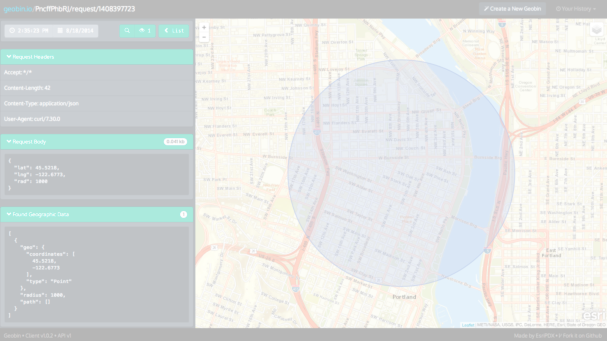

# [fit] _geobin.io_
## [fit] __*Visualizing geographic POSTs since 2014!*__
 
 
[http://geobin.io/](http://geobin.io)
[http://github.com/esripdx/geobin.io/](http://github.com/esripdx/geobin.io)

---

# [fit] *Esri Portland R&D Center*

__Ryan Arana, @aranasaurus__

__Josh Yaganeh, @hsoj__

__Courtland Fowler, @FowlerCourt__

__Nate Goldman, @ungoldman__

---

# [fit] *What is __Geobin__?*

---

# *A web app that visualizes data posted to a URL*

---

# [fit] __...with a map!__

---

---

# [fit] Why did we make it?

---

# [fit] *"RequestBin is cool, but..."*

---

# [fit] Questions?

---

*Thanks!*
[geobin.io](http://geobin.io) 
 
*Ryan Arana*
[@aranasaurus](http://twitter.com/aranasaurus)
[rarana@esri.com](mailto:rarana@esri.com)

*Josh Yaganeh*
[@hsoj](http://twitter.com/hsoj)
[jyaganeh@esri.com](mailto:jyaganeh@esri.com)

