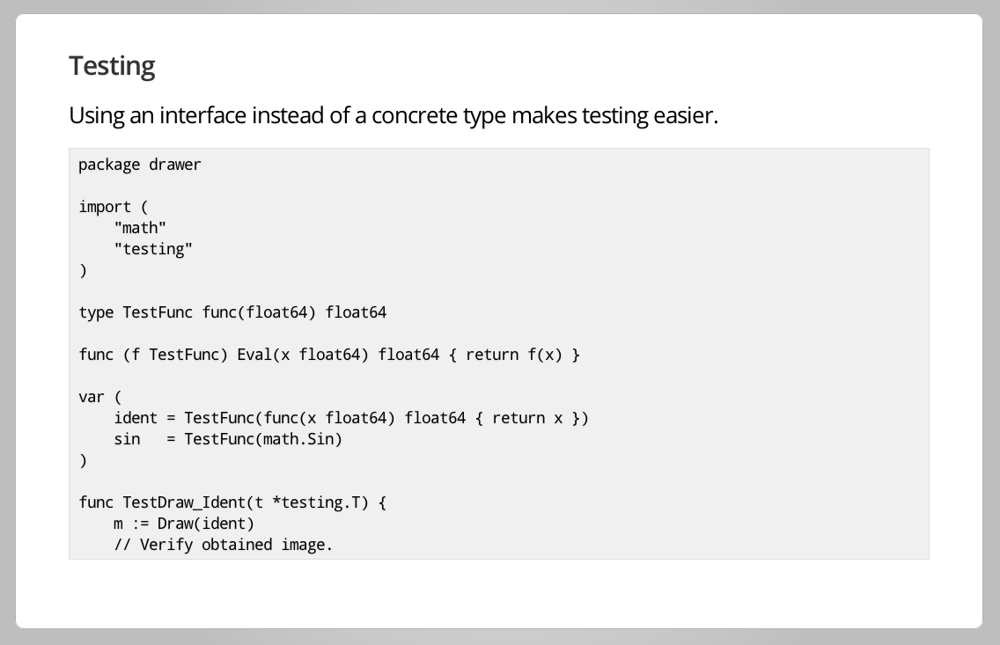

# [fit] geobin.io
## [fit] Overview and Lessons Learned
<br />
<br />
<br />
__http://github.com/esripdx/geobin-talk/__


---

# Esri Portland R&D Center
__Courtland Fowler__
_@FowlerCourt_

__Josh Yaganeh__
_@hsoj_

__Ryan Arana__
_@aranasaurus_

<br />

__Nate Goldman__ - UI/UX + general javascript wizardry
_@ungoldman_

---

# [fit] It's like RequestBin...
# [fit] with a map

---

# [fit] Mini Demo

---

# [fit] Why did we make it?

- "RequestBin is cool, but..."
- Debugging/Visualizing the Geotrigger Service as we built other tools around it


---

# [fit] Demo!

### [fit] Geotrigger Editor __>__ Faker __>__ Geobin

---

# [fit] Components

- Parsing the Data
- Websockets
- Mocking Redis for tests
- Rate-limiting Middleware
- Deployment Process

---

# [fit] Parsing the Data

---

HTTP POST:

```json
[{
    "title": "I've got geojson",
    "data": { "message": "Standards rule!" },
    "geo": {
        "type": "Point",
        "coordinates": [-122.6763, 45.5218]
    }
}, {
    "title": "I've got my own geo data schema",
    "data": { "message": "ohai!" },
    "geo": { 
        "lat": 45.5218,
        "lng": -122.6763,
        "rad": 100
    }
}]
```

---

# Arbitrary JSON
### How we determine if an object has Geo Information in it

```javascript
{
  "foo": "bar",
  "x": -122.6366, // 'long', 'lng', 'longitude'
  "y": 45.5264,   // 'lat', 'latitude'
  "radius": 100   // 'accuracy', 'acc', 'distance', 'dist', 'rad'
}

// or...

{
  "geo": [-122.6366, 45.5264] // 'coord[s]', 'coordinate[s]', 'loc', 'location'
}
```

---

```
 XXX  XXX  XXX  XXX  XX                 +------------+               +-----------------------+
XXXXXXXXXXXXXXXXXXXXXXXX                |            |     YES       |                       |
XXX                  XXX                |  Is it     +-------------> |  Add to foundGeo set  |
 X   HTTP POST JSON   X +-------------> |  GeoJSON?  |               |           &           |
XXX                  XXX                |            | <----+        |  Save path to object  |
XXXXXXXXXXXXXXXXXXXXXXXX                +------+-----+      |        |                       |
 XXX  XXX  XXX  XXX  XX                        |            |        +-----------------------+
                               +---------------+            |                            ^
                               |       NO                   +------------------------+   |
                               v                                                     |   |
                                                       +-----------------------+     |   |
                 +--------------------------+          |                       |     |   |
                 |                          |  +-------+ Save valid values for |     |   |
                 | Iterate through its keys +--+       | our flagged geo keys  |     |   |
                 |                          |  |       |                       |     |   |
                 +-------------+------------+  |       +-----------------------+     |   |
                               |               |                                     |   |
                               |               |   +------------------------------+  |   |
                               v               +---+ Value of key is object/array +--+   |
                                                   +------------------------------+      |
             +---------------------------------+                                         |
             |                                 |                                         |
             | Did we get at least an x and y? |                                         |
             |                                 |                                         |
             +---------------------------------+                                         |
                               |                                                         |
                               |   YES                                                   |
                               +---------------------------------------------------------+
```


---

# Channels

- WaitGroup and channel per request
- Fire up a goroutine that just waits for geo data to come in from the channel and adds it to an in-memory slice when it comes in.
- Parse method fires up a goroutine each time it's called and calls itself recursively to find any geo data in the object, sending it through the channel when it does.

---

# What was wrong with that?

- Race conditions!
- Goroutines sticking around forever because of unclosed channels.

---

# Mutex

- Each request calls Parse and then waits on the WaitGroup
- Parse method adds 1 to the WaitGroup then fires up a goroutine and parses the object it was given, recursively calling itself until it gets to all of the leaf nodes.
- This time, when it finds a geo object it calls a method which locks the mutex, appends to the found geo slice, unlocks and moves on.

---

# Websockets (yay!)
[github.com/gorilla/websocket](http://www.gorillatoolkit.org/pkg/websocket)

---

# [fit] socket struct
```golang
s := &s{
    name:      name,
    ws:        ws,
    send:      make(chan []byte, 256),
    shutdown:  make(chan bool),
    closed:    false,
    closeLock: &sync.Mutex{},
    onRead:    or,
    onClose:   oc,
}

go s.writePump()
go s.readPump()
return s
```

---

# [fit] trimming down the interface
```golang
// S exposes some methods for interacting with a websocket
type Socket interface {
    // Submits a payload to the web socket as a text message.
    Write([]byte)
    // return the provided name
    GetName() string
    // Close the socket.
    Close()
}
```

---

# [fit] keeping track of sockets
```golang
type SocketMap interface {
    Add(binName, socketUUID string, s Socket)
    Get(binName, socketUUID string) (Socket, bool)
    Delete(binName, socketUUID string) error
    Send(binName string, payload []byte) error
}
```

---

# [fit] concurrency with redis!
```golang
// redis client
client := redis.NewTCPClient(&redis.Options{
    Addr:     conf.RedisHost,
    Password: conf.RedisPass,
    DB:       conf.RedisDB,
})

// redis pubsub connection
ps := client.PubSub()

// prepare a socketmap
sm := NewSocketMap(ps)

// loop for receiving messages from Redis pubsub, and forwarding them on to relevant ws connection
go redisPump(ps, sm)

defer func() {
    ps.Close()
    client.Close()
}()
```

---

## Redis Mocking

- Recall Francesc's [best practices](http://talks.golang.org/2013/bestpractices.slide#24)!



---

# [fit] interfaces making testing easier!
```golang
// mock our use of redis pubsub for modularity/testing purposes
type PubSubber interface {
    Subscribe(channels ...string) error
    Unsubscribe(channels ...string) error
}

// mock our use of redis client for modularity/testing purposes
type RedisClient interface {
    ZAdd(key string, members ...redis.Z) (int64, error)
    ZCount(key, min, max string) (int64, error)
    Expire(key string, dur time.Duration) (bool, error)
    Publish(channel, message string) (int64, error)
    ZRevRange(key, start, stop string) ([]string, error)
    Exists(key string) (bool, error)
    Get(key string) (string, error)
    Incr(key string) (int64, error)
}
```

---

# [fit] tests without dependencies
```golang
type MockRedis struct {
    sync.Mutex
    bins  map[string][]string
    incrs map[string]string
}

type MockPubSub struct{}

func NewMockRedis() *MockRedis {
    return &MockRedis{
        bins:  make(map[string][]string),
        incrs: make(map[string]string),
    }
}
```

---

# Rate Limiting

```go
key := fmt.Sprintf("rate-limit:%s:%d", r.URL.Path, time.Now().Unix())

if keyExistsInRedis(key) && requestCount(key) > requestsPerSec {
    http.Error(w, "stahp!", http.StatusServiceUnavailable)
    return
}

incrementRequestCount(key)

// continue serving request
```

---

# Basic Middleware

```go
func myMiddleware(h http.HandlerFunc) http.HandlerFunc {
    return func(w http.responseWriter, r *http.Request) {

        // do rate limiting

        h.ServeHTTP(w, r)
    }
}
```

---

# Rate Limit Middleware
```go
func rateLimit(h http.HandlerFunc) http.HandlerFunc {
    return func(w http.responseWriter, r *http.Request) {
        key := fmt.Sprintf("rate-limit:%s:%d", r.URL.Path, time.Now().Unix())

        if keyExistsInRedis(key) && requestCount(key) > requestsPerSec {
            http.Error(w, "stahp!", http.StatusServiceUnavailable)
            return
        }

        incrementRequestCount(key)

        h.ServeHTTP(w, r)
    }
}

r := http.NewServeMux()
r.HandleFunc("/api/1/foo", rateLimit(fooHandler))
```

---

# [fit] Deployment Process

---

# Questions?


---

# Thanks!

- Ryan Arana
_@aranasaurus_ | github.com/aranasaurus

- Josh Yaganeh
_@hsoj_ | github.com/jyaganeh

- Courtland Fowler
_@FowlerCourt_ | github.com/courtf

__http://geobin.io/__
__http://github.com/esripdx/geobin-talk/__

